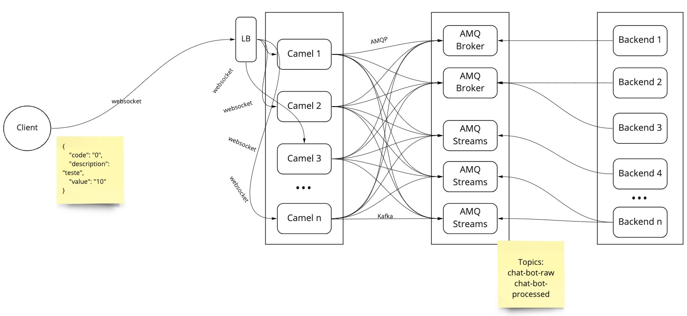

= Chatbot

This is a project that compares performance of AMQ Broker (ActiveMQ Artemis) and AMQ Streams (Strimzi - Kafka) in a simple scenario where messages don't require persistence.



== Directory structure 

```
chatbot-kafka-artemis
└───camel-ws-to-event - responsible to produce messages in kafka and artemis
└───camel-quarkus-kafka-consumer - consumer for messages in kafka
└───camel-quarkus-artemis-consumer - consumer for messages in artemis
└───camel-ws-to-event-artemis - responsible to produce messages only in artemis
```

== Running Tests

docker.io/lasher/artilharia

    artillery run performance-tests/artillery-plan.yaml

